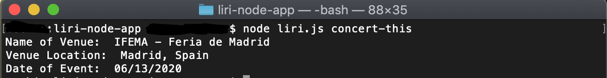
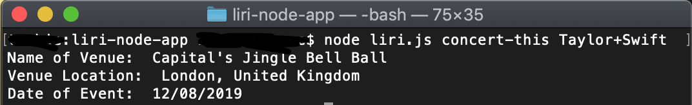
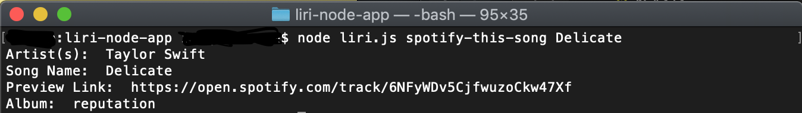
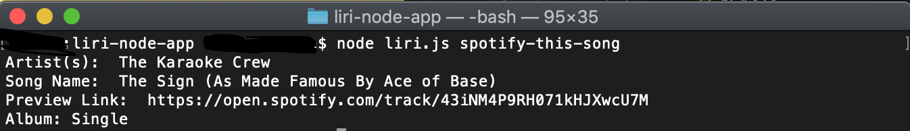
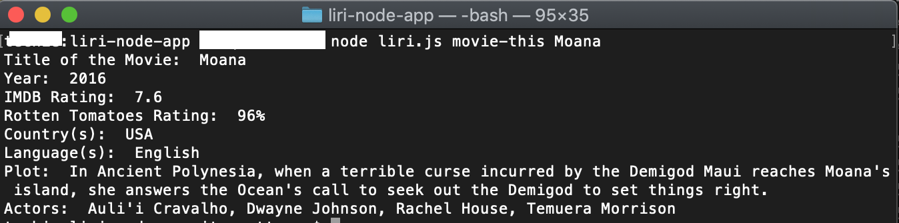
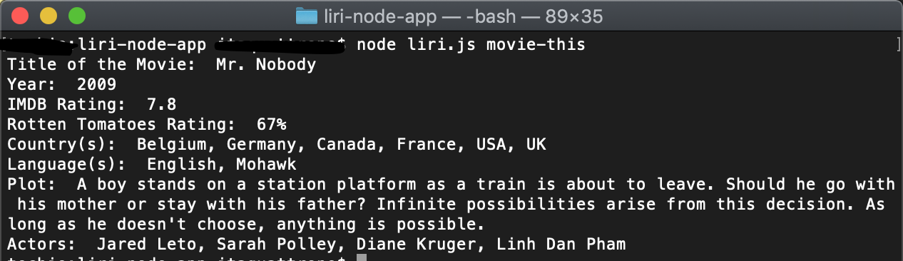
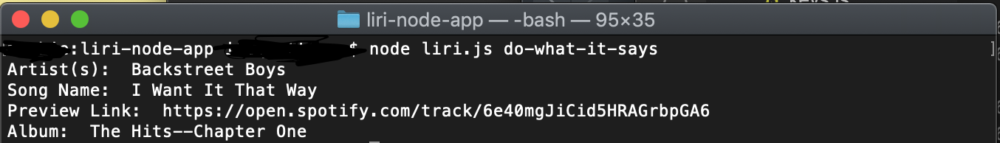
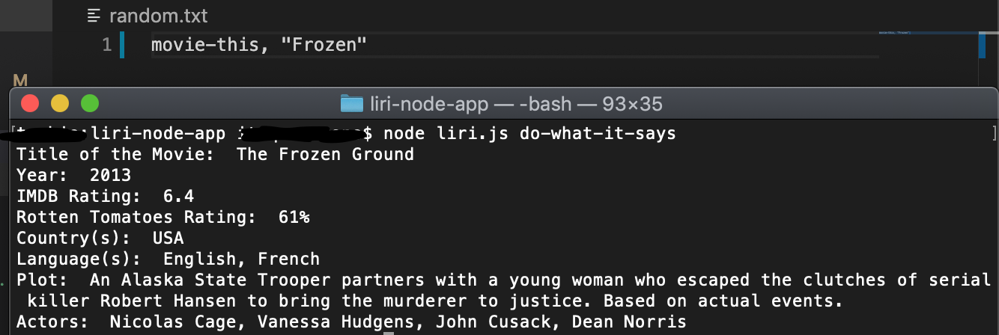
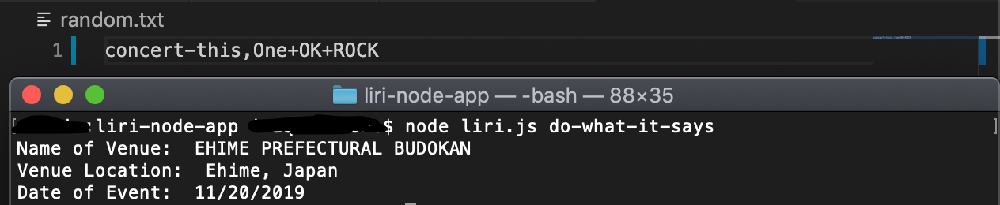

# Liri Node App
This terminal based application makes API calls to OMDB, Bands in Town, and Spotify, to produce answers to queries about movies, concerts, and songs.

## Requirements

[X] Get Spotify API working.

[X] Get IMDB API working.

[X] Get Bands In Town API working.

[X] Get concert-this command to work.

[X] Use moment to format time for concert-this as "MM/DD/YYYY"

[X] Get spotify-this-song command to work.

[X] Get movie-this command to work.

[X] Get do-what-it-says command to work.

### node liri.js concert-this <artist/band name here>

Searches the Bands in Town Artist Events API for an artist and render the following information about each event to the terminal:

- Name of the venue
- Venue location
- Date of the Event

Without a Query (defaults to Ace of Base)

With a Query

### node liri.js spotify-this-song <song name here>

This will show the following information about the song in your terminal/bash window

- Artist(s)
- The song's name
- A preview link of the song from Spotify
- The album that the song is from

If no song is provided then the program will default to "The Sign" by Ace of Base.

### node liri.js movie-this <movie name here>

This will output the following information to your terminal/bash window:

   * Title of the movie.
   * Year the movie came out.
   * IMDB Rating of the movie.
   * Rotten Tomatoes Rating of the movie.
   * Country where the movie was produced.
   * Language of the movie.
   * Plot of the movie.
   * Actors in the movie.

If the user doesn't type a movie in, the program will output data for the movie 'Mr. Nobody.'

### node liri.js do-what-it-says

Using the fs Node package, LIRI will take the text inside of random.txt and then use it to call one of LIRI's commands.

It should run spotify-this-song for "I Want It That Way," as follows the text in random.txt.

Edit the text in random.txt to test out the feature for movie-this and concert-this.

